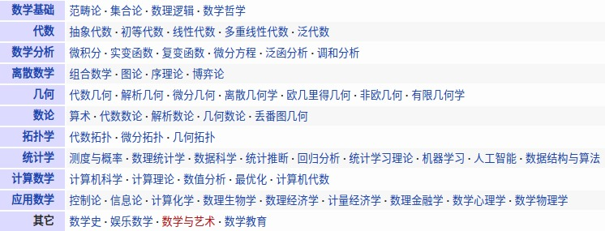
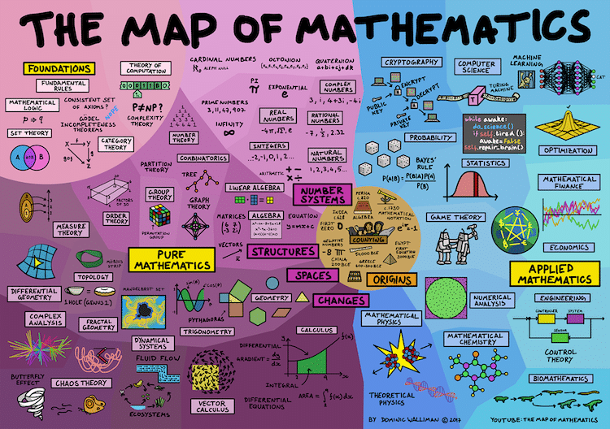

# Mathematics & Scientific Computing

* https://cggos.github.io/categories.html#Math

------

[TOC]

# Overview

* [Mathematics (Wikipedia)](https://en.wikipedia.org/wiki/Mathematics)
* [Wolfram](http://www.wolfram.com): Computation Meets Knowledge
  - [Wolfram MathWorld](http://mathworld.wolfram.com): The Web's Most Extensive Mathematics Resource
  - [Wolfram|Alpha](https://www.wolframalpha.com/): Computational Intelligence

* [S.O.S. MATHematics](http://www.sosmath.com) is your free resource for math review material from Algebra to Differential Equations!

  

  

# Math Software

## Online Tools

* [云算网](http://www.yunsuan.info): 用云计算技术在线为您求解矩阵运算，数学规划，和数据挖掘领域内的一系列问题
* [Online Matrix Calculator](http://www.bluebit.gr/matrix-calculator/)

## Programming

* math_libs.md
* [Mathematical software - swMATH](https://www.swmath.org/)
* [Programs in Mathematics](https://www.mathprograms.org)
* [Mathematical Programming Society](http://www.mathprog.org/)
* [Math ∩ Programming](https://jeremykun.com/)

### Python

### Matlab

### R

* [The R Project for Statistical Computing](https://www.r-project.org/)
* [Introduction to R](http://ramnathv.github.io/pycon2014-r/)

### Data Analysis

* [QtiPlot](https://www.qtiplot.com/) is a cross platform data analysis and scientific visualisation solution
* [OriginLab](https://www.originlab.com/) - Data Analysis and Graphing Software
* [D3.js](https://d3js.org/) is a JavaScript library for manipulating documents based on data
* [Circos](http://circos.ca/) is a software package for visualizing data and information

#### gnuplot

* [gnuplot homepage](http://www.gnuplot.info/)
* [gnuplot 让您的数据可视化](https://www.ibm.com/developerworks/cn/linux/l-gnuplot/)

# Maths Topics

* 偏导数、方向导数、梯度、微分

## Linear Algebra

* [Computational Linear Algebra course](https://www.fast.ai/2017/07/17/num-lin-alg/)
* [Numerical Recipes Home Page](http://numerical.recipes/)

### Matrix Algebra

* 正定、半正定、负定，解线性方程组

## Numerical Analysis

## Discrete Maths

* [hongshin/DiscreteMath](https://github.com/hongshin/DiscreteMath)

## Geometry

## Optimization

* [cggos/state_estimation_cg](https://github.com/cggos/state_estimation_cg)

# Books

* *[Introduction to Scientific Programming: Computational Problem Solving Using Maple and C](https://www.cs.utah.edu/~zachary/IntroSciProg.html)*
