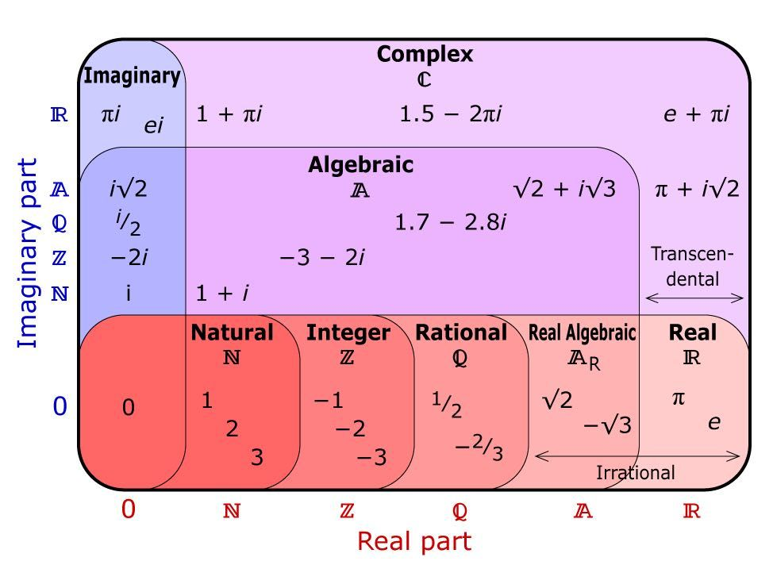

# Mathematics & Scientific Computing

* Source Code: https://github.com/cggos/scikit

* Blog (CGABC): https://cgabc.xyz/categories/Maths/

------

## Overview

* [Mathematics (Wikipedia)](https://en.wikipedia.org/wiki/Mathematics)

* [S.O.S. MATHematics](http://www.sosmath.com) is your free resource for math review material from Algebra to Differential Equations!

  

  

## Programming

* [Mathematical software - swMATH](https://www.swmath.org/)
* [Programs in Mathematics](https://www.mathprograms.org)
* [Mathematical Programming Society](http://www.mathprog.org/)
* [Math ∩ Programming](https://jeremykun.com/)

## Maths Topics

  

* Math Basics
    * 偏导数、方向导数、梯度、微分

* Linear Algebra
    * [Computational Linear Algebra course](https://www.fast.ai/2017/07/17/num-lin-alg/)
    * [Numerical Recipes Home Page](http://numerical.recipes/)

* Numerical Analysis

*  Discrete Maths
    * [hongshin/DiscreteMath](https://github.com/hongshin/DiscreteMath)

* Geometry

* Optimization
    * [cggos/state_estimation](https://github.com/cggos/state_estimation)

## Books

* *[Introduction to Scientific Programming: Computational Problem Solving Using Maple and C](https://www.cs.utah.edu/~zachary/IntroSciProg.html)*
